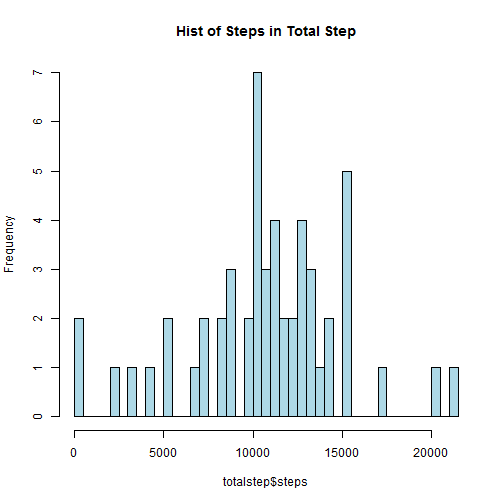
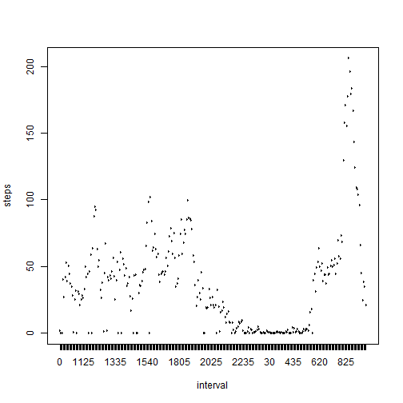
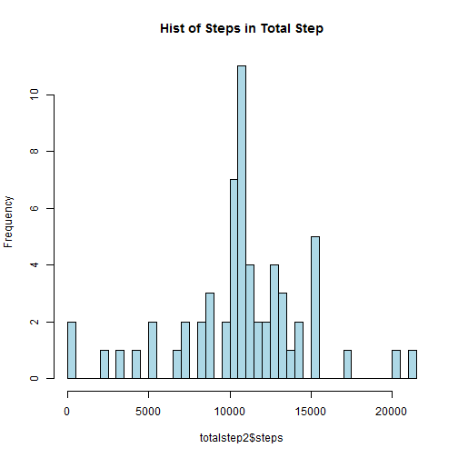

## Loading the data  


```r
Sys.setlocale("LC_TIME", "English")
```

```
## [1] "English_United States.1252"
```

```r
setwd('C:/Users/Marcus/Dropbox/R script/ReproResearch/peer assignment A/repdata-data-activity')
#setwd('C:/Users/marcus.chen/Dropbox/R script/ReproResearch/peer assignment A/repdata-data-activity')
activity<-read.csv('activity.csv',na.strings = "NA",colClasses = c("integer", "Date", "factor"))
```
* Process/transform the data (if necessary) into a format suitable for your analysis

```r
totalstep<-aggregate(steps~date,data=activity,sum,na.rm=TRUE)
```

## What is mean total number of steps taken per day?  

1.Make a histogram of the total number of steps taken each day

```r
hist(totalstep$steps,breaks=50,main='Hist of Steps in Total Step',col='lightblue')
```

 
2.Calculate and report the **mean** and **median** total number of steps taken per day  


```r
mean(totalstep$steps)
```

```
## [1] 10766.19
```

```r
median(totalstep$steps)
```

```
## [1] 10765
```
* The mean total number of steps taken per day is 10766.19 steps.  
* The median total number of steps taken per day is 10765 steps.  
    
## What is the average daily activity pattern?  

1. Make a time series plot (i.e. type = "l") of the 5-minute interval (x-axis) and the average number of steps taken, averaged across all days (y-axis)


```r
intervalOfStep<-aggregate(steps~interval,data=activity,mean,na.rm=TRUE)
plot(steps~interval,data=intervalOfStep,type="l")
```

 

2. Which 5-minute interval, on average across all the days in the dataset, contains the maximum number of steps?  

```r
intervalOfStep[which.max(intervalOfStep$steps),]$interval
```

```
## [1] 835
## 288 Levels: 0 10 100 1000 1005 1010 1015 1020 1025 1030 1035 1040 ... 955
```

It is the 835th interval.

## Imputing missing values  

1. Calculate and report the total number of missing values in the dataset (i.e. the total number of rows with NAs)

```r
sum(is.na(activity$steps))
```

```
## [1] 2304
```
* There are 2304 rows are missing.  

2. Devise a strategy for filling in all of the missing values in the dataset. The strategy does not need to be sophisticated. For example, you could use the mean/median for that day, or the mean for that 5-minute interval, etc.  

* The missing values are filled with the mean step of that interval.  

```r
interval2steps<-function(interval){
    intervalOfStep[intervalOfStep$interval==interval,]$steps
}
```

3. Create a new dataset that is equal to the original dataset but with the missing data filled in.


```r
#Make a copy of original data and filled it with the mean value of step in intervals which have missing value.
activity.new<-activity
for(i in 1:nrow(activity.new)){
    if(is.na(activity.new[i,]$steps)){
        activity.new[i,]$steps<-interval2steps(activity.new[i,]$interval)
       
    }
}
```

4. Make a histogram of the total number of steps taken each day and Calculate and report the mean and median total number of steps taken per day. 

```r
totalstep2<-aggregate(steps~date,data=activity.new,sum)
hist(totalstep2$steps,breaks=50,col='lightblue',main='Hist of Steps in Total Step')
```

 

```r
mean(totalstep2$steps)
```

```
## [1] 10766.19
```

```r
median(totalstep2$steps)
```

```
## [1] 10766.19
```
* The mean total number(10766.19) of steps taken per day is equal to the median total number(10766.19) of steps taken per day.   


5. Do these values differ from the estimates from the first part of the assignment? What is the impact of imputing missing data on the estimates of the total daily number of steps?  

* The mean value is the smae, however the median value changed a little bit and align with mean value.    

## Are there differences in activity patterns between weekdays and weekends?   

* Create a new factor variable in the dataset with two levels ¡§weekday¡¨ and ¡§weekend¡¨ indicating whether a given date is a weekday or weekend day.

```r
activity.new$day=ifelse(as.POSIXlt(activity.new$date)$wday%%6==0,"weekends","weekday") 
activity.new$day=factor(activity.new$day,levels=c("weekday","weekends"))
```


* Make a panel plot containing a time series plot (i.e. type = "l") of the 5-minute interval (x-axis) and the average number of steps taken, averaged across all weekday days or weekend days (y-axis). The plot should look something like the following, which was creating using simulated data:


```r
library(lattice)
intervalByDay=aggregate(steps~interval+day,activity.new,mean)
xyplot(steps~interval|factor(day),data=intervalByDay,aspect=0.5,type="l")
```

 
